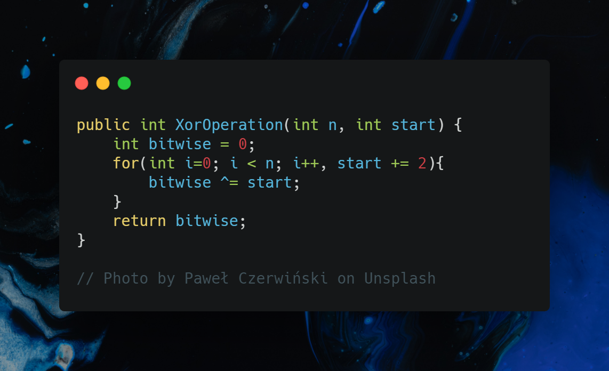

# Leet Code Solutions

## About this project
The idea is to share the code challenges I've taken at [LeetCode](https://leetcode.com/). 

## Why?

The main goal is to improve logical thinking skills as well as expanding my knowledge on low-level C# performance improvements.

## Solved challenges so far
- [1480. Running Sum of 1d Array](https://leetcode.com/problems/running-sum-of-1d-array/)
- [1470. Shuffle the Array](https://leetcode.com/problems/shuffle-the-array/)
- [1486. XOR Operation in an Array](https://leetcode.com/problems/xor-operation-in-an-array/)
- [1108. Defanging an IP Address](https://leetcode.com/problems/defanging-an-ip-address/)